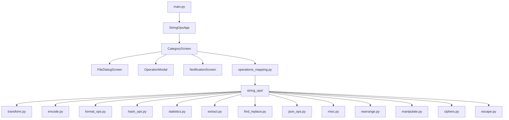
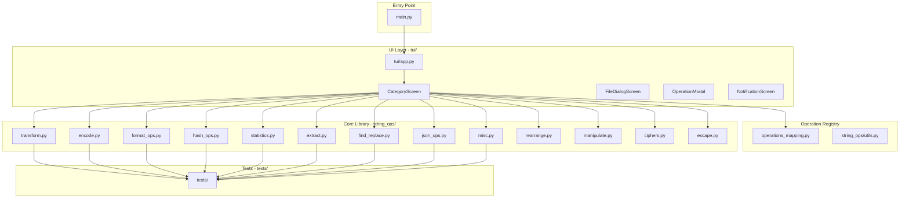
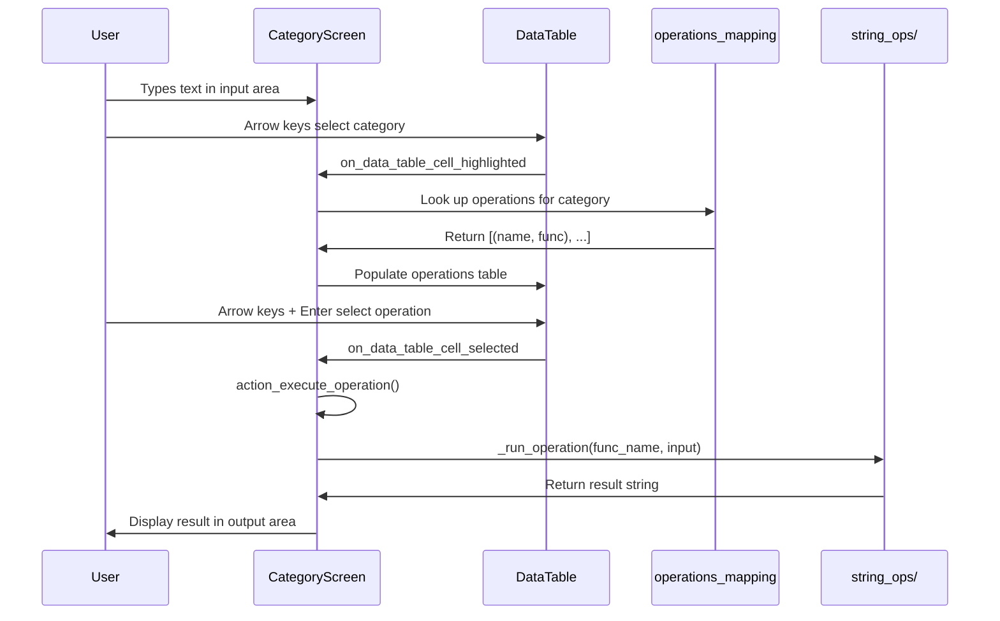
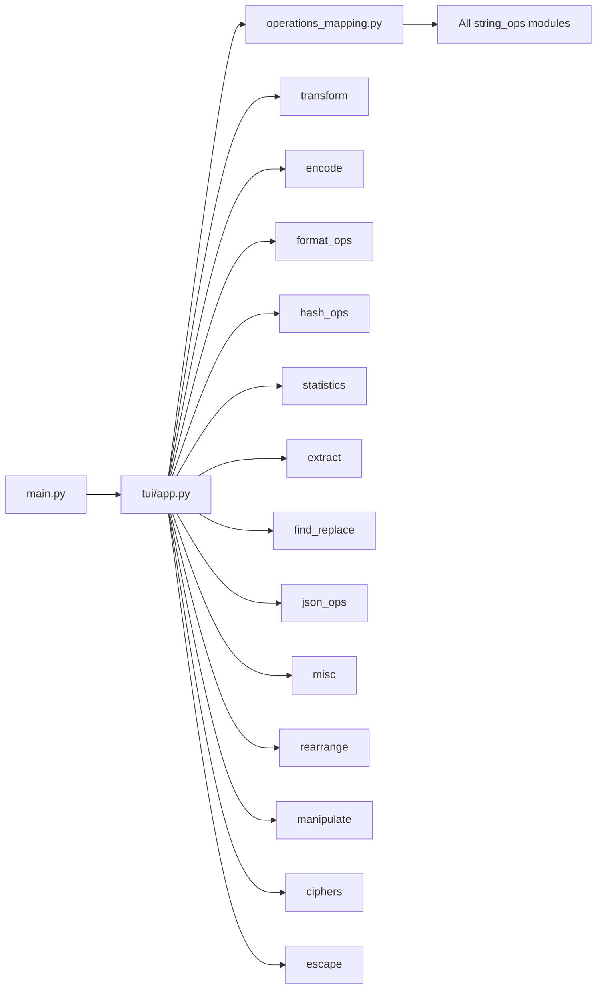

# Architecture

## High-Level Overview

## Layer Architecture

## Data Flow

## Module Dependency Graph

## Key Design Decisions

- **Single-file TUI**: The entire TUI lives in `tui/app.py` (4 classes: `CategoryScreen`, `StringOpsApp`, `FileDialogScreen`, `NotificationScreen`, `OperationModal`).
- **Operation registry**: `operations_mapping.py` maps 200+ operations to 12 categories. Each entry is `(display_name, function_name)`.
- **Late import**: Core modules are imported inside `_run_operation()` to avoid circular dependencies and speed up startup.
- **Module dispatch**: A large `module_map` dictionary routes function names to their implementing modules.
- **Real-time apply**: Text input changes trigger immediate operation execution via `on_text_area_changed`.
- **Reactive UI**: Built on Textual, a modern async TUI framework for Python.
