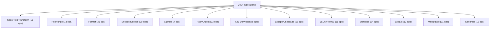
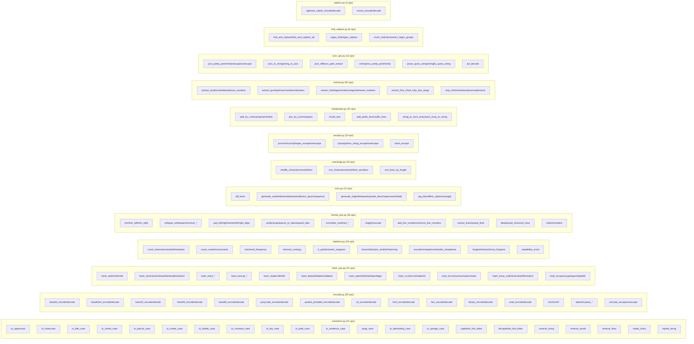
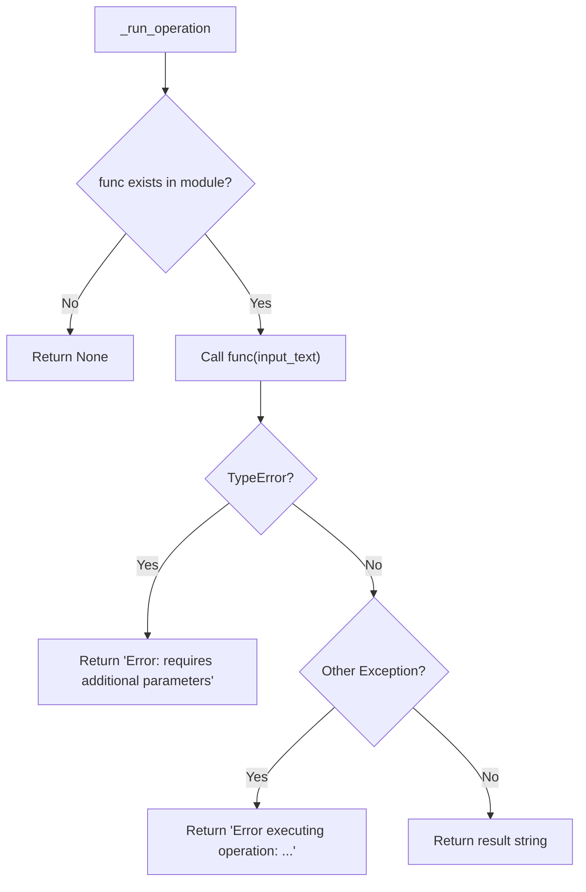

# Operations & Categories

## Overview

The project provides 200+ string operations organized into 12 categories. Each operation is a pure function that takes a string (and optionally parameters) and returns a transformed string.

## Category Map



## Operation Registry

Operations are registered in `operations_mapping.py`:

```python
OPERATIONS = {
    "Category Name": [
        ("Display Name", "function_name"),
        ...
    ],
    ...
}
```

The TUI uses two data structures built from this registry:
- `_operations`: `{category: [(display_name, func_name), ...]}` — for populating the operations table
- `_operation_map`: `{display_name: func_name}` — for dispatching operations by name

## Module-to-Operation Mapping



## Operation Function Signature

All operations follow a common pattern:

```python
def operation_name(input_text: str, **kwargs) -> str:
    """Description of what the operation does."""
    # ... implementation ...
    return result
```

Operations that need additional parameters (like `find_and_replace`, `rotate_chars`, `repeat_string`) show a modal dialog (via `OperationModal`) when selected, since they can't execute with just the input string.

## Error Handling



## Categories Detail

| # | Category | Module(s) | Count |
|---|----------|-----------|-------|
| 1 | Case/Text Transform | `transform.py` | 16 |
| 2 | Rearrange | `rearrange.py`, `transform.py` | 13 |
| 3 | Format | `format_ops.py` | 21 |
| 4 | Encode/Decode | `encode.py` | 29 |
| 5 | Ciphers | `ciphers.py` | 4 |
| 6 | Hash/Digest | `hash_ops.py` | 33 |
| 7 | Key Derivation | `hash_ops.py` | 8 |
| 8 | Escape/Unescape | `escape.py`, `encode.py` | 15 |
| 9 | JSON/Format | `json_ops.py` | 11 |
| 10 | Statistics | `statistics.py` | 24 |
| 11 | Extract | `extract.py` | 13 |
| 12 | Manipulate | `manipulate.py` | 11 |
| 13 | Generate | `misc.py` | 12 |
