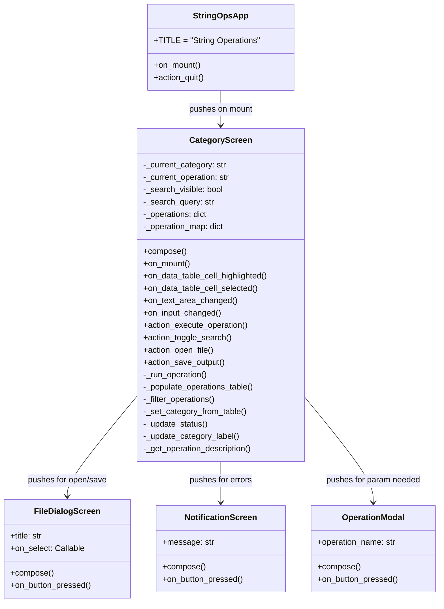
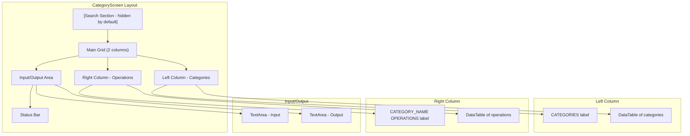
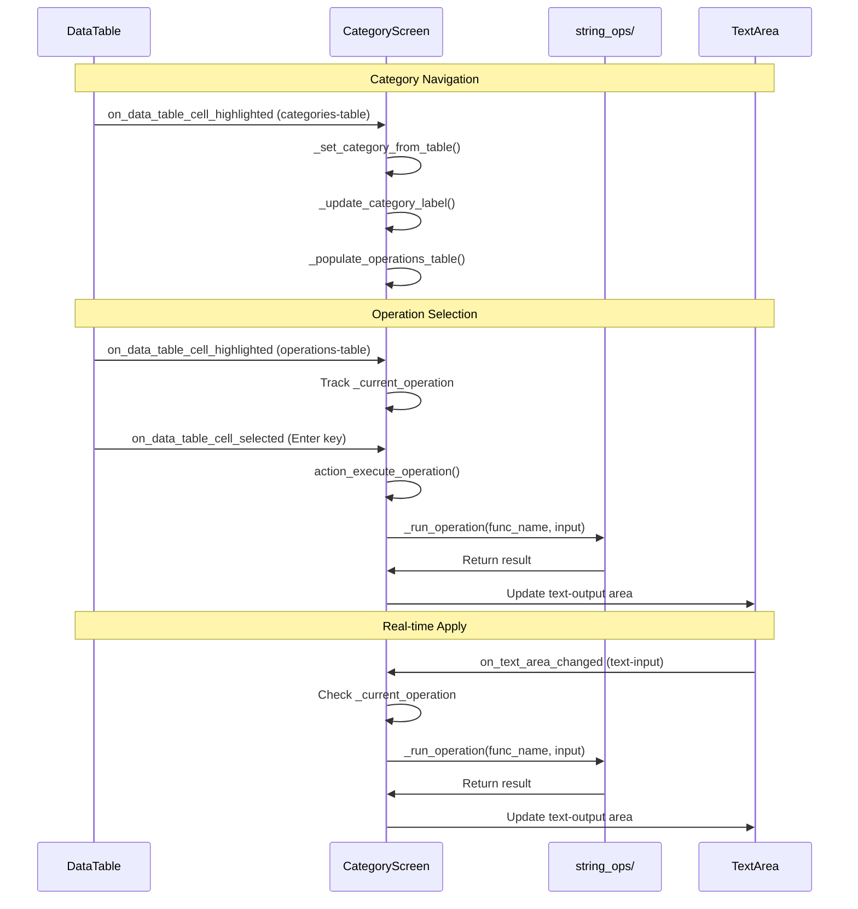

# TUI Layer

## Overview

The TUI (Terminal User Interface) is built on [Textual](https://textual.textualize.io/), a modern Python framework for building rich terminal applications.

All TUI code lives in `tui/app.py`.

## Class Hierarchy

## Screen Layout

## Keyboard Shortcuts

| Key | Action | Description |
|-----|--------|-------------|
| `Up` / `Down` | Navigate | Move cursor in categories or operations table |
| `Enter` | Execute | Run the highlighted operation |
| `Tab` | Focus Next | Cycle through panes (categories -> operations -> input -> output) |
| `Ctrl+/` | Toggle Search | Show/hide the search bar |
| `Ctrl+O` | Open File | Open file dialog to load text into input |
| `Ctrl+S` | Save Output | Save output area content to file |
| `Q` | Quit | Exit the application |

## Event Flow

## CSS Styling

The UI uses Textual's CSS-like styling defined in `CategoryScreen.CSS`:

- **Grid layout**: 2-column main grid (categories + operations)
- **Borders**: `$primary` colored borders on panes
- **Search visibility**: Controlled via `.visible` class toggling `display: block/none`
- **Status bar**: `$primary` background at the bottom
- **Category label**: `$accent` background header for each pane

## Key Bindings

Two levels of bindings exist:

1. **StringOpsApp**: Only `q` for quit (global).
2. **CategoryScreen**: `q`, `ctrl+o`, `ctrl+s`, `ctrl+/`, `tab`, `enter`.

The `show=False` on the `enter` binding prevents it from appearing in the footer, since Enter behavior is implicit in DataTable usage.
